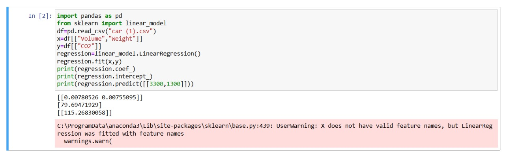

# Implementation of Multivariate Linear Regression
## Aim
To write a python program to implement multivariate linear regression and predict the output.
## Equipment’s required:
1.	Hardware – PCs
2.	Anaconda – Python 3.7 Installation / Moodle-Code Runner
## Algorithm:
### Step1: Import pandas as pd.

### Step2: Read the csv file.

### Step3: Get the value of X and y variables.

### Step4: Create the linear regression model and fit.

### Step5: Predict the CO2 emission of a car where the weight is 2300kg, and the volume is 1300cm cube and print the output.

## Program:
```
Developed by : Dhashvanth B
Register number : 212224230064


import pandas as pd
from sklearn import linear_model
df=pd.read_csv("car (1).csv")
x=df[["Volume","Weight"]]
y=df[["CO2"]]
regression=linear_model.LinearRegression()
regression.fit(x,y)
print(regression.coef_)
print(regression.intercept_)
print(regression.predict([[3300,1300]]))


```
## Output:


## Result
Thus the multivariate linear regression is implemented and predicted the output using python program.